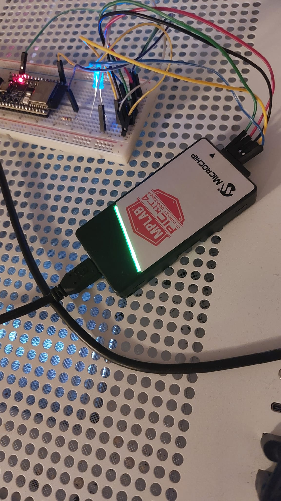

# PIC10F200 assembly project

PIC10F200 project for learning low level assembly and reading documentation.
Includes simple blink project, and a timer0 module implmentation.
PIC-Kit-4 used for debugging, and ESP32 used for supplying voltage.

https://ww1.microchip.com/downloads/en/DeviceDoc/40001239F.pdf

